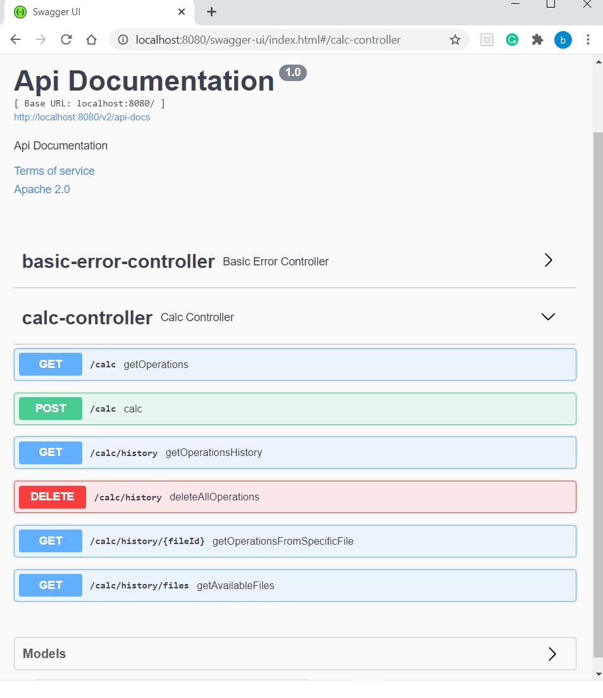
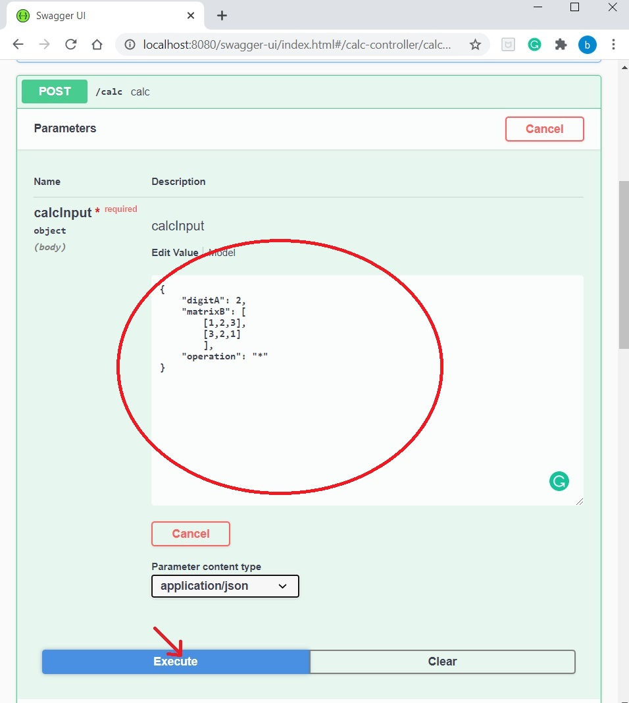

# intive CalcRestApi

Aplikacja webowa umożliwiająca obliczenia na liczbach rzeczywistych, wektorach i macierzach.

### Wymagania wstępne

[Java 11](https://adoptopenjdk.net/)

### Uruchomienie programu

Aby zainstalować aplikację wywołaj następujące komendy w konsoli:

```
git clone https://github.com/barbara-tyndorf/intive_RestAPI.git
cd intive_RestAPI
```

Uruchom aplikację za pomocą komendy:

```
mvn clean package spring-boot:repackage
cd target
java -jar calc-0.0.1-SNAPSHOT.jar
```

Następnie uruchom swoją przeglądarkę i wejdź pod adres:

```
http://localhost:8080/swagger-ui/index.html
```

### Instrukcja użytkowania

Po uruchomieniu przeglądarki i przejściu pod wskazany adres powinien ukazać się taki widok:


Kliknij strzałkę zaznaczoną czerwonym kółkiem. Ukaże Ci się lista możliwych do wykonania operacji:



Kliknij na wybraną zakładkę, aby się rozwinęła. Następnie naciśnij przycisk`Try it out`.


Wywołanie `getOperations` wyświetli plik z możliwymi do wykonania operacjami.

W przypadku wywołania `calc` masz możliwość wykonania obliczeń.

Teraz w zaznaczonym poniżej białym polu możesz podać swoje wartości. Podaj dwie wartości oraz typ operacji w postaci JSON.

Przykładowe dane wejściowe i możliwe działania:

- dwie liczby rzeczywiste:

  - dodawanie `+`
  - odejmowanie `-`
  - mnożenie `*`
  - dzielenie `/`
  - potęgowanie `^`, zakres wykładnika <0,128>
  - pierwiastkowanie drugiego stopnia `#`

  ```
  {
      "digitA": 5.5,
      "digitB": 2.5,
      "operation": "-"
  }
  ```

  ```
  {
      "digitA": 9,
      "operation": "#"
  }
  ```

- liczba rzeczywista i wektor (maksymalnie 4-elementowy) lub macierz (maksymalnie 4x4)

  - mnożenie

    ```
    {
        "digitA": 2,
        "vectorB": [1,2,3],
        "operation": "*"
    }
    ```

    lub

    ```
    {
        "digitA": 2,
        "matrixB": [
        		[1,2,3],
        		[3,2,1]
        		],
        "operation": "*"
    }
    ```

- dwa wektory (maksymalnie 4-elementowe, oba wektory muszą posiadać tyle samo elementów)

  - dodawanie `+`

  - odejmowanie `-`

    ```
    {
        "vectorA": [3,2,1],
        "vectorB": [1,2,3],
        "operation": "+"
    }
    ```

- dwie macierze (maksymalny wymiar 4 x 4)

  - dodawanie `+ `(obie macierze muszą posiadać takie same wymiary)
  - odejmowanie `-` (j.w.)
  - mnożenie `*` (druga macierz musi mieć tyle samo kolumn, ile wierszy ma pierwsza)

  ```
  {
      "matrixA": [
      		[3,2,1],
      		[1,2,3]
      		],
      "matrixB": [
      		[1,2,3],
      		[3,2,1]
      		],
      "operation": "+"
  }
  ```

  lub

  ```
  {
      "matrixA": [
      		[3,2,1],
      		[1,2,3]
      		],
      "matrixB": [
      		[1,2],
      		[3,1],
      		[1,3]
      		],
      "operation": "*"
  }
  ```

- macierz i wektor

  - mnożenie `*` (wektor, musi on mieć tyle składowych, ile kolumn ma macierz)

  ```
  {
      "matrixA": [
      		[3,2,1],
      		[1,2,3]
      		],
      "vectorB": [1,2,3],
      "operation": "*"
  }
  ```

Aby wykonać obliczenia kliknij `Execute`.



`getOperationsHistory` wyświetli listę ostatnich operacji.

`deleteAllOperations`wyczyści listę ostatnich operacji.

`getOperationsFromSpecyficFile`wyświetli listę operacji z konkretnego pliku, po podaniu jego id (najpierw wywołaj `getAvailableFiles`, aby zobaczyć listę dostępnych plików).

## Autor

**Barbara Tyndorf** - [LinkedIn Profile](https://www.linkedin.com/in/barbara-tyndorf/)
