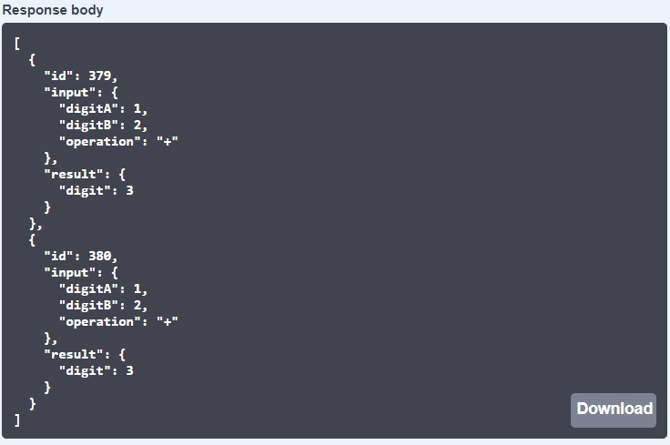

# intive CalcRestApi

Aplikacja webowa umożliwiająca obliczenia na liczbach rzeczywistych, wektorach i macierzach oraz zapis wykonanych obliczeń do pliku, lub lokalnie do bazy danych H2.

### Wymagania wstępne

 Java 11 lub wyższa do pobrania [tutaj.](https://adoptopenjdk.net/)

### Uruchomienie programu

Aby zainstalować aplikację wywołaj następujące komendy w konsoli:

```
git clone https://github.com/barbara-tyndorf/intive_RestAPI.git
cd intive_RestAPI
```

Uruchom aplikację za pomocą komendy:

```
mvn clean package spring-boot:repackage
cd target
java -jar calc-0.0.1-SNAPSHOT.jar
```

Następnie uruchom swoją przeglądarkę i wejdź pod adres:

http://localhost:8080/swagger-ui/index.html

### Instrukcja użytkowania

Po uruchomieniu przeglądarki i przejściu pod wskazany adres powinien ukazać się taki widok:


Kliknij strzałkę zaznaczoną czerwonym kółkiem. Ukaże Ci się lista możliwych do wywołania metod:


Kliknij na wybraną zakładkę, aby się rozwinęła. Następnie naciśnij przycisk `Try it out`.


Wywołanie `getOperations` wyświetli plik z możliwymi do wykonania operacjami.

W przypadku wywołania `calc` masz możliwość wykonania obliczeń.

Teraz w zaznaczonym poniżej białym polu możesz podać swoje wartości. Podaj dwie wartości A i B (w przypadku pierwiastkowania tylko A) oraz typ operacji w postaci JSON.


Przykładowe dane wejściowe i możliwe działania:

- dwie liczby rzeczywiste:

  - dodawanie `+`
  - odejmowanie `-`
  - mnożenie `*`
  - dzielenie `/`
  - potęgowanie `^`, zakres wykładnika <0,128>
  - pierwiastkowanie drugiego stopnia `#`

  ```
  {
      "digitA": 5.5,
      "digitB": 2.5,
      "operation": "-"
  }
  ```

  ```
  {
      "digitA": 9,
      "operation": "#"
  }
  ```

- liczba rzeczywista i wektor (maksymalnie 4-elementowy) lub macierz (maksymalnie 4x4)

  - mnożenie

    ```
    {
        "digitA": 2,
        "vectorB": [1,2,3],
        "operation": "*"
    }
    ```

    lub

    ```
    {
        "digitA": 2,
        "matrixB": [
        		[1,2,3],
        		[3,2,1]
        		],
        "operation": "*"
    }
    ```

- dwa wektory (maksymalnie 4-elementowe, oba wektory muszą posiadać tyle samo elementów)

  - dodawanie `+`

  - odejmowanie `-`

    ```
    {
        "vectorA": [3,2,1],
        "vectorB": [1,2,3],
        "operation": "+"
    }
    ```

- dwie macierze (maksymalny wymiar 4 x 4)

  - dodawanie `+ `(obie macierze muszą posiadać takie same wymiary)
  - odejmowanie `-` (j.w.)
  - mnożenie `*` (druga macierz musi mieć tyle samo kolumn, ile wierszy ma pierwsza)

  ```
  {
      "matrixA": [
      		[3,2,1],
      		[1,2,3]
      		],
      "matrixB": [
      		[1,2,3],
      		[3,2,1]
      		],
      "operation": "+"
  }
  ```

  lub

  ```
  {
      "matrixA": [
      		[3,2,1],
      		[1,2,3]
      		],
      "matrixB": [
      		[1,2],
      		[3,1],
      		[1,3]
      		],
      "operation": "*"
  }
  ```

- macierz i wektor

  - mnożenie `*` (wektor, musi on mieć tyle składowych, ile kolumn ma macierz)

  ```
  {
      "matrixA": [
      		[3,2,1],
      		[1,2,3]
      		],
      "vectorB": [1,2,3],
      "operation": "*"
  }
  ```

Aby wykonać obliczenia kliknij `Execute`.


Następnie otrzymasz wynik obliczeń, ewentualnie komunikat, jeśli wprowadzone dane nie pozwalają na wykonanie obliczenia oraz status odpowiedzi.


`getOperationsHistory` wyświetli listę ostatnich operacji.

`deleteAllOperations` wyczyści listę operacji.

`getFile` wyświetli wybrany plik z historii po podaniu jego nazwy (uwaga: działa tylko przy ustawieniu zapisu do pliku, czytaj: [sterowanie zapisem historii operacji](#sterowanie-zapisem-historii-operacji))

`getPossibleOperationRange` w zależności od wybranej opcji zapisu danych, wyświetli:

- dostępne pliki historii operacji

  

- listę id operacji możliwych do pobrania

  

  

`getOperationsFromRange` wyświetli w zależności do wybranej opcji zapisu danych:

- listę operacji z zakresu wybranych plików (podaj nr plików, pole `end` możesz pozostawić puste, wtedy otrzymasz listę operacji od pliku wskazanego w polu `start` do ostatniej wykonanej operacji)

  

  

- listę operacji z zakresu podanych id od `start` do `end`, jeśli nie podasz wartości końcowej `end` otrzymasz listę operacji od początku zakresu `start` do ostatniej operacji.

  

  

### Sterowanie zapisem historii operacji

Domyślnie aplikacja zapisuje historię operacji do plików w katalogu `/historia`  w folderze tymczasowym. Lokalizację katalogu tymczasowego można uzyskać wywołując metodę:

```
System.out.println(System.getProperty("java.io.tmpdir"));
```

W przypadku zapisu do plików wartość `calc.history-service` w pliku:

```
~main\resources\application.properties
```

  jest pusta. Aby zapisywać historię do bazy danych należy przypisać wartość `db`.


W przypadku zapisu do bazy danych H2 można wykonywać dowolne działania w ramach zapytań SQL. W tym celu należy wprowadzić w przeglądarce adres:

http://localhost:8080/h2-console

Pojawi się okno logowania, jak poniżej:


Sprawdź czy adres URL, User Name oraz Password są zgodne z powyższymi. Następnie naciśnij `Connect`.

Teraz możesz wyszukać potrzebne dane za pomocą zapytań SQL. W polu zaznaczonym dużym kołem wpisz swoje zapytanie. Następnie wciśnij run (zielony przycisk play, na który wskazuje strzałka). 


Poniżej pojawi się tablica wybranych rekordów.


## Autor

**Barbara Tyndorf** - [LinkedIn](https://www.linkedin.com/in/barbara-tyndorf/)
